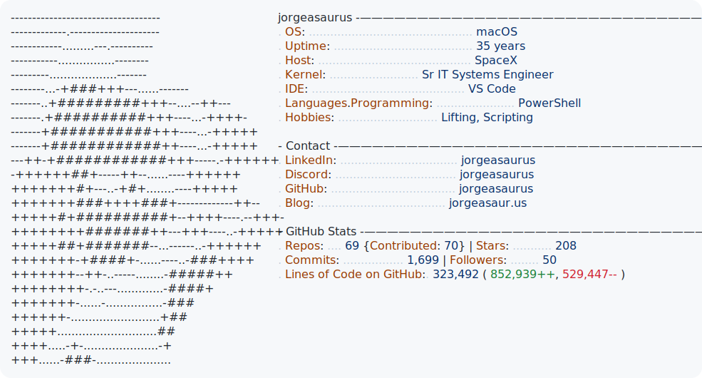

<picture>
  <source media="(prefers-color-scheme: dark)" srcset="dark_mode.svg">
  
</picture>

---

# DevReadme

A config-driven GitHub Profile README generator that displays your stats in a neofetch-style format. Fork this repo to create your own dynamic profile README with auto-updating GitHub statistics.

## Features

- Neofetch-style display with customizable ASCII art
- Auto-updating GitHub stats (repos, stars, commits, followers, lines of code)
- Dark/light mode support (automatically matches GitHub's theme)
- Fully configurable via a simple PowerShell hashtable
- Daily updates via GitHub Actions

## Quick Setup

### 1. Fork & Clone

Fork this repository to your GitHub account, then clone it:

```bash
git clone https://github.com/YOUR_USERNAME/YOUR_USERNAME.git
cd YOUR_USERNAME
```

> **Note:** For this to work as your profile README, your repo must be named the same as your GitHub username.

### 2. Create a GitHub Token

Create a **classic personal access token** at [github.com/settings/tokens](https://github.com/settings/tokens/new) with these scopes:

- [x] `repo` (or `public_repo` for public repos only)
- [x] `read:user`

### 3. Add Repository Secrets

Go to your repo's **Settings > Secrets and variables > Actions** and add:

| Secret Name | Value |
|-------------|-------|
| `ACCESS_TOKEN` | Your GitHub personal access token |
| `USER_NAME` | Your GitHub username |

### 4. Edit Configuration

Edit `config.ps1` with your information:

```powershell
$Config = @{
    Username  = "your-username"
    BirthYear = 1990  # Used for "Uptime" display

    Profile = [ordered]@{
        OS                      = "Your OS"
        Uptime                  = $null  # Auto-calculated from BirthYear
        Host                    = "Your Company"
        Kernel                  = "Your Job Title"
        IDE                     = "Your IDE"
        "Languages.Programming" = "Your Languages"
        Hobbies                 = "Your Hobbies"
    }

    Contact = [ordered]@{
        LinkedIn = "your-linkedin"
        Discord  = "your-discord"
        GitHub   = "your-github"
        Blog     = "your-blog.com"
    }
    # ... rest of config
}
```

### 5. Customize ASCII Art (Optional)

Edit `ascii-art.txt` with your own ASCII art. Keep it around 25 lines tall for best results.

### 6. Generate SVGs

For local development, create `env.ps1`:

```powershell
$env:ACCESS_TOKEN = "your_token_here"
$env:USER_NAME = "your_username"
```

Then generate the SVG templates:

```powershell
pwsh -NoProfile ./New-ProfileSvg.ps1
```

And update with your GitHub stats:

```powershell
pwsh -NoProfile ./today.ps1
```

### 7. Push & Enable Actions

```bash
git add .
git commit -m "Personalize profile README"
git push
```

Go to **Actions** tab and enable workflows. The action runs daily at 4 AM UTC to update your stats.

## File Structure

```
├── config.ps1           # Your configuration (edit this!)
├── ascii-art.txt        # Your ASCII art (customize this!)
├── New-ProfileSvg.ps1   # Generates SVG templates from config
├── today.ps1            # Updates dynamic GitHub stats
├── env.ps1              # Local credentials (don't commit!)
├── dark_mode.svg        # Generated dark theme SVG
├── light_mode.svg       # Generated light theme SVG
└── cache/               # LOC calculation cache
```

## How It Works

1. `New-ProfileSvg.ps1` reads your config and generates the SVG templates with placeholders for dynamic data
2. `today.ps1` queries the GitHub GraphQL API for your stats and updates the SVGs
3. GitHub Actions runs `today.ps1` daily to keep stats current
4. GitHub renders the SVG in your profile, automatically switching between dark/light mode

## Credits

Based on [Andrew6rant/Andrew6rant](https://github.com/Andrew6rant/Andrew6rant), converted to PowerShell with a config-driven architecture.

## License

MIT
